# Driverless Control Project

## Description
The project aims to implement a feedback controller for a Formula Student Driverless vehicle, using a kinematic bicycle model. 
Paths in different forms are generated (straight, circular, sinusoidal, chicane), and then different controllers are tested (Proportional, PID, Stanley).

---

## Project Structure
```bash
DRIVERLESS-INITIAL-PROJECT/
├── .vscode/                     # VSCode settings
│
├── build/                       # CMake build directory (auto-generated)
│   ├── .cmake/
│   ├── CMakeFiles/
│   ├── cmake_install.cmake
│   ├── CMakeCache.txt
│   ├── compile_commands.json
│   └── driverless-initial-project
│
├── data/                        # Input files for simulation
│   ├── input.txt
│   └── inputFields.txt
│
├── docs/                        # Pictures of simulations
│
├── include/                     # Header files
│   ├── control.hpp
│   ├── controller.hpp
│   ├── environment.hpp
│   ├── graphics.hpp
│   ├── io.hpp
│   ├── noise.hpp
│   ├── path.hpp
│   ├── sim.hpp
│   └── vehicle.hpp
│
├── src/                         # Source files
│   ├── control.cpp
│   ├── graphics.cpp
│   ├── io.cpp
│   ├── main.cpp
│   ├── noise.cpp
│   ├── path.cpp
│   ├── sim.cpp
│   └── vehicle.cpp
│
├── .gitignore                   # Git ignore rules
└── CMakeLists.txt               # Build configuration 
```
## Installation & Build Instructions

### Requirements
- C++17 Compiler
- CMake
- Raylib

### Build
```bash
cd projectRooot
mkdir build
cd build
cmake ..
make
cd projectRoot
./build/driverless-initial-project
```
---
## Usage

### Configurate parameters
You can configure parameters inside
```bash
data/input.txt
```
You can view what each parameter is inside
```bash
data/inputFields.txt
```

### Output Windows
- Trajectory of Standard Vehicle using Kinematic Bycicle Model (Task 1)
- Trajectory of Standard Vehicle with Lateral Drift (Task 2)
- Trajectory of Vehicle, Controlled to Have a Straight Heading (Task 2)
- Trajectory of Vehicle, Controlled to Have a Straight Heading, with Noise and Lateral Drift (Task 2)
- Straight Path and Trajectory of Vehicle Using P Controller (Task 3)
- Straight Path and Trajectory of Vehicle Using PID Controller (Task 4)
- Straight Path and Trajectory of Vehicle Using Stanley Controller (Task 5)
- Circular Path and Trajectory of Vehicle Using P Controller (Task 3)
- Circular Path and Trajectory of Vehicle Using PID Controller (Task 4)
- Circular Path and Trajectory of Vehicle Using Stanley Controller (Task 5)
- Sine Path and Trajectory of Vehicle Using P Controller (Task 3)
- Sine Path and Trajectory of Vehicle Using PID Controller (Task 4)
- Sine Path and Trajectory of Vehicle Using Stanley Controller (Task 5)
- Chicane Path and Trajectory of Vehicle Using PID Controller (Task 4)
- Chicane Path and Trajectory of Vehicle Using Stanley Controller (Task 5)

---

## Features
<table> <tr> <td style="vertical-align:top; width:50%">

### Vehicle
- Full kinematic bicycle model  
- Lateral drift simulation  
- Gaussian noise in heading angle

### Path Generation
- Straight path  
- Circle path  
- Sine path  
- Chicane Path
</td> <td style="vertical-align:top; width:50%">

### Controllers
- Straight Path Controller
- P controller  
- PID controller  
- Stanley controller 

### Visualization
- Real-time Raylib 2D rendering  
- Scaled coordinate axes and grid
- Path drawing
- Vehicle Trajectory drawing
</td> </tr> </table>
---

## Included Mathematics

### Kinematic Bicycle Model

\[
x_{t+1} = x_t + v \cos(\theta_t)\,dt
\]

\[
y_{t+1} = y_t + v \sin(\theta_t)\,dt
\]

\[
\theta_{t+1} = \theta_t + \frac{v}{L}\tan(\delta_t)\,dt
\]

### Controller Formulas

P Controller

\[
\delta = K_p \cdot e
\]

PID Controller

\[
\delta = K_p e + K_d \frac{de}{dt} + K_i \int e \, dt
\]

Stanley Controller

\[
\delta = \theta_e + \tan^{-1}\left(\frac{K e}{v}\right)
\]

### Cross-Track Error (CTE)
Computed as the perpendicular distance from the vehicle to the nearest point on the path.


---

# Short Report

## Approach Used

The project follows a modular design, with separate classes for Vehicle, Path, Environment, and Controller.

First, the kinematic bicycle model is implemented and tested visually. To ensure proper visualization, the maximum coordinate reached by the vehicle (either x or y) is computed and used to scale the axes proportionally.

Then, different paths are generated. The initial coordinate and heading are defined by the user, and each path type uses its own parameters (e.g., radius for circles, amplitude/wavelength for sine waves).

During simulation, the vehicle uses a specific controller to update its steering angle at each time step. In some tests, lateral drift and Gaussian noise are applied to observe their impact on the vehicle's trajectory.

The visualizer displays the vehicle trajectory (yellow) and the path (blue).

---

## Controller Tuning Strategy

For the P controller, Kp was gradually increased starting from small values (~0.1) until oscillations occurred.

For the PID controller, tuning followed this approach:
- Start with a small 
- Set Ki = 0 and Kd = 0
- Increase Kd to reduce oscillations
- Add a very small Ki to correct steady-state error

For the Stanley controller, the gain Ks was tested from small values (0.1) upward. Higher values made the vehicle go closer to the path, but unstable steering appeared beyond a certain value.

---

## Challenges Faced

The biggest challenge was understanding the mathematics behind the project — from heading geometry to the behavior of each controller.

Additionally, this was my first time using Raylib, so creating the visualization system was hard at first.

Tuning the controllers for short, sharp paths, when the vehicle had a high speed also proved challenging.

# Simulation Results

### 1. Standard Models

Standard Bicycle Model 


Standard Model with Lateral Drift

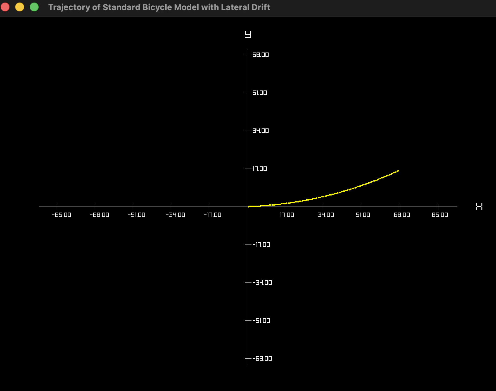

### 2. Heading Control

Straight Heading

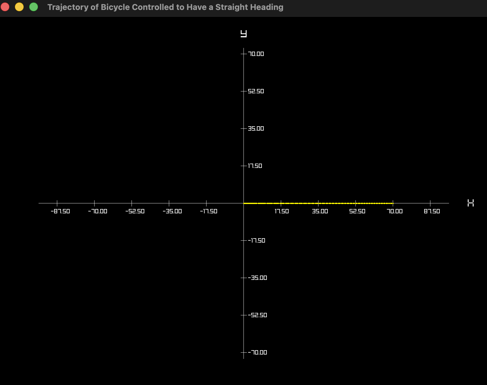

Straight Heading with Drift & Noise

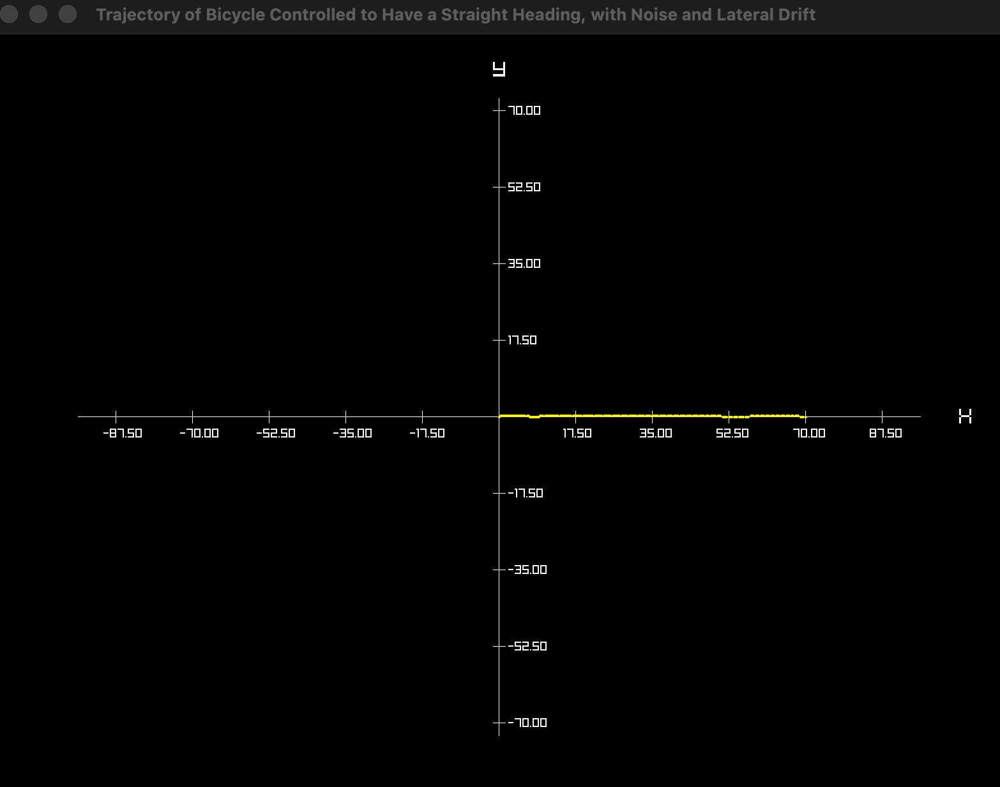

### 3. Straight Path Following

Straight Path – P Controller


Straight Path – PID Controller

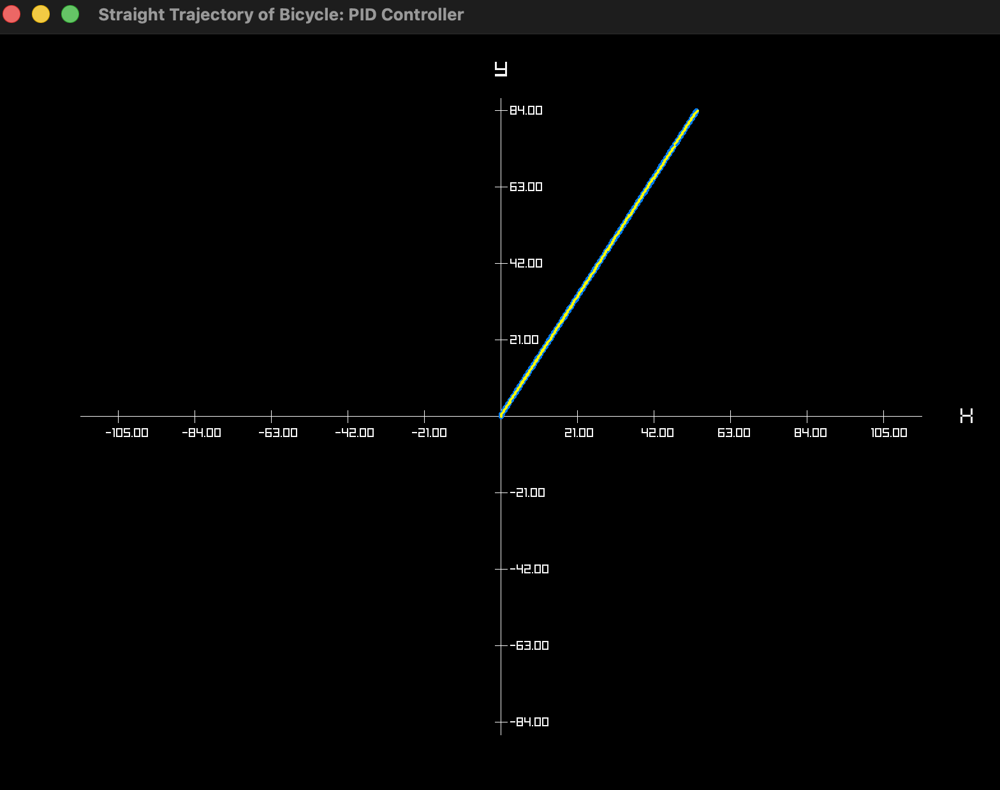

Straight Path – Stanley Controller

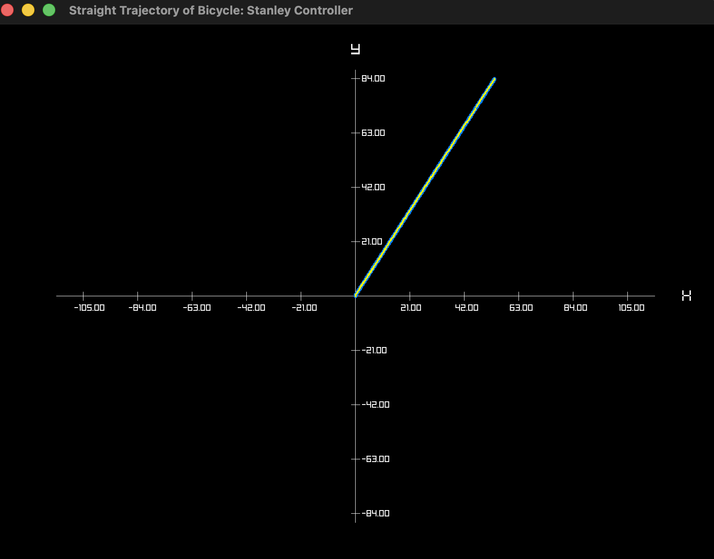

### 4. Circular Path Following

Circular Path – P Controller

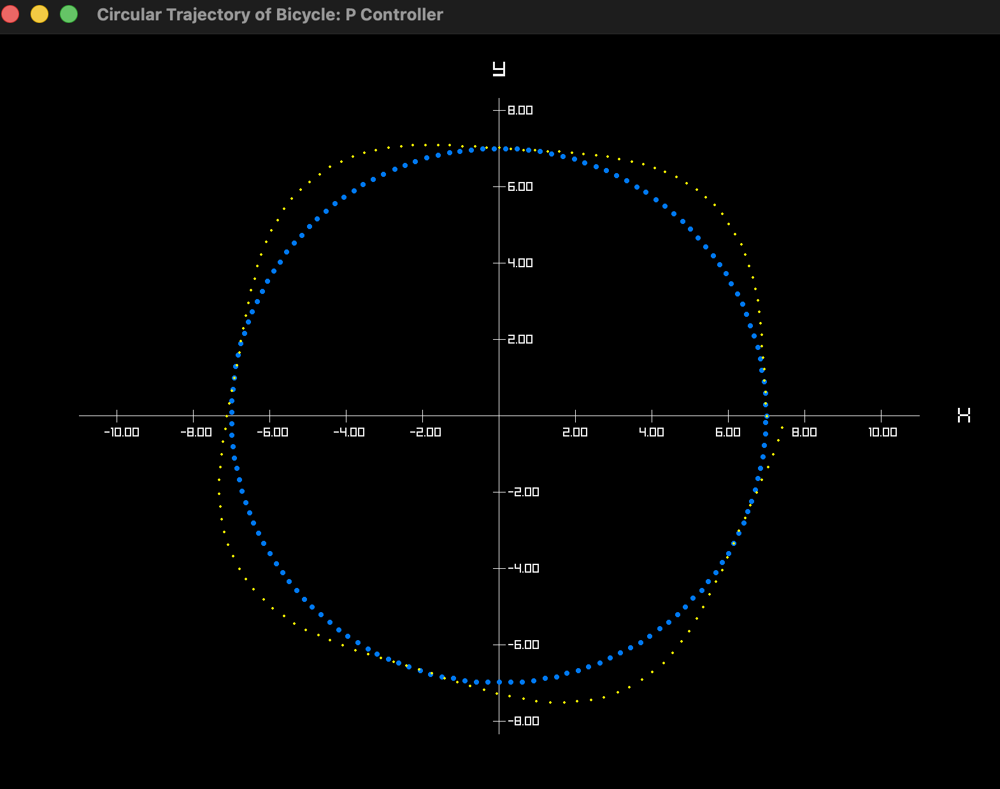

Circular Path – PID Controller

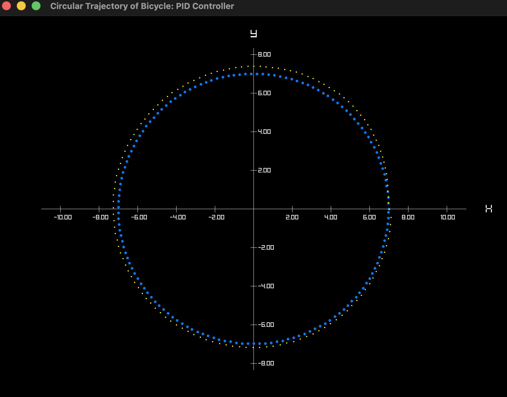

Circular Path – Stanley Controller

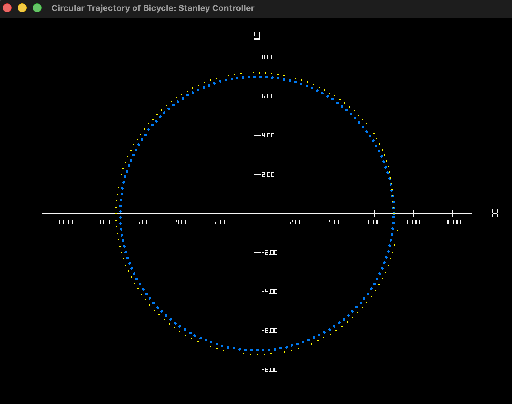

### 5. Sine Path Following

Sine Path – P Controller

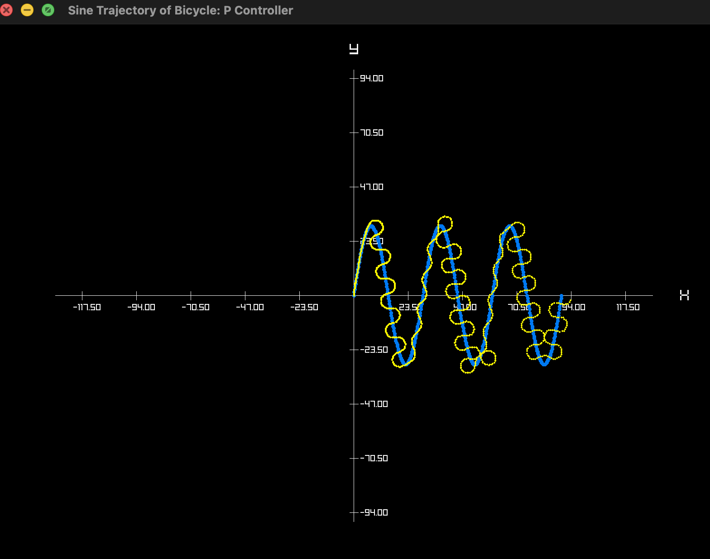

Sine Path – PID Controller

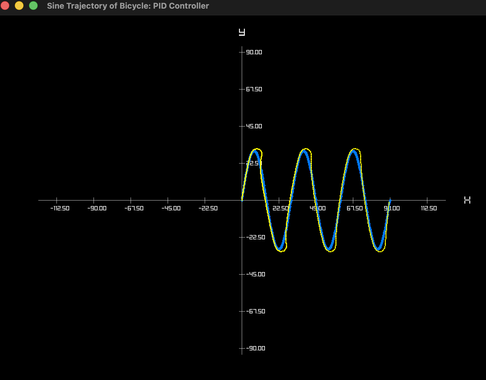

Sine Path – Stanley Controller

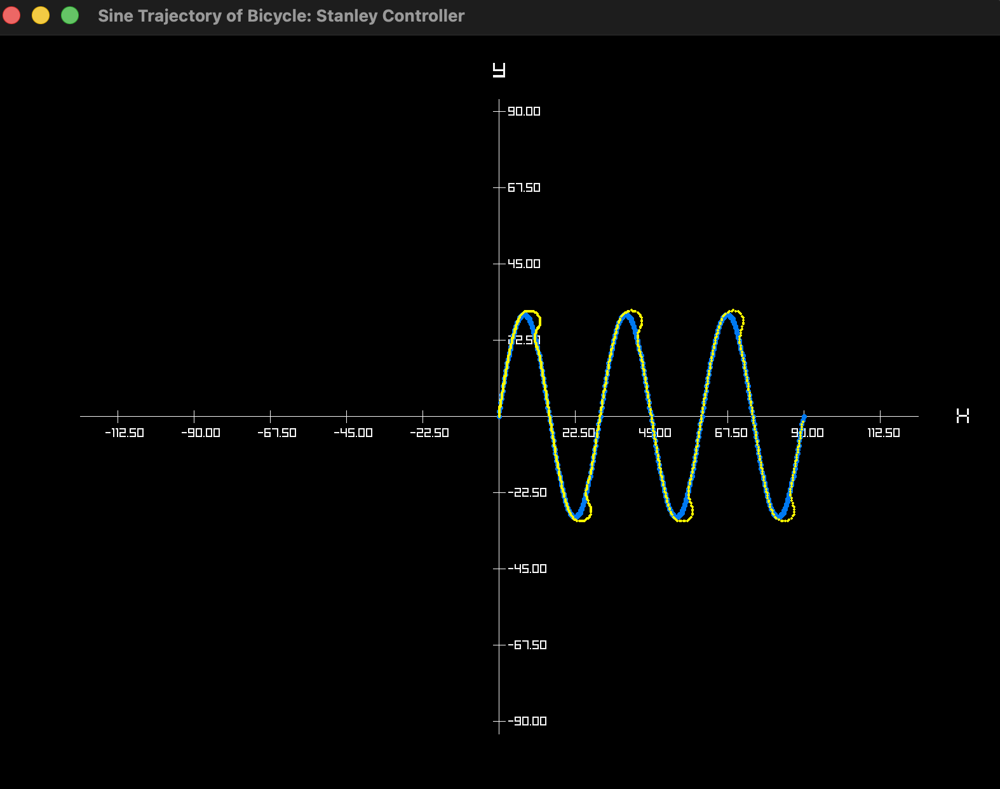

### 6. Chicane Path Following

Chicane Path – PID Controller

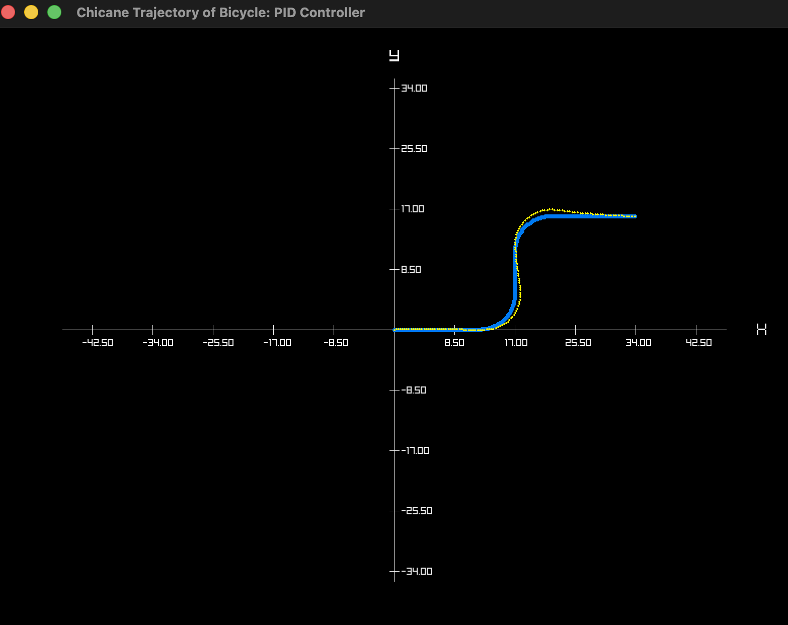

Chicane Path – Stanley Controller

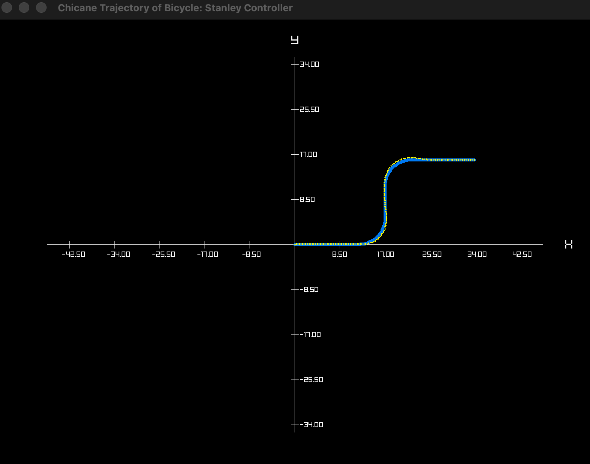

---

## Author
Dragos Baiu  
